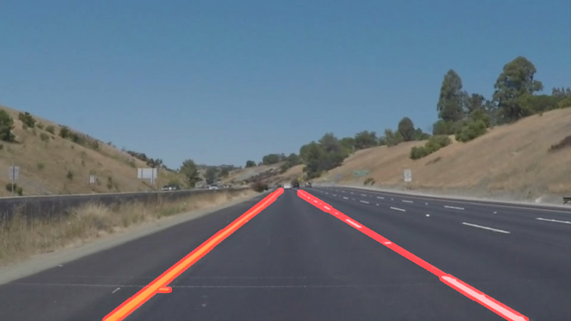

# **Finding Lane Lines on the Road** 

## Finding Lane Lines on an Image and Video Stream

### The Project Consist of a two step process where I first find the lane lines on an image of California's I-280 Highway and following this I use a video stream recorded by Sebastian Thurn and his team to detect the lane lines on the video stream of a road.

---

**Finding Lane Lines on the Road**

In this I used the image and video samples given in Project 1 for Self-Driving Car Engineer Nanodegree Program to detect the lane lines using OpenCV and Python. The project consists of the first stage where I develop the pipeline for processing the input images using diffrent levels of image tranformation using OpenCV and Python to detect the lines of special characterization to detect the lane lines on a road. Once a reasonably accuracte lane detection of an image is completed, I moved onto the next stage of the project where I attempted to tweak the drawlines() function to extrapolate the lane lines such that segmented lane lines will have a thick strong lane lines indicating the full lane line. 

The goals / steps of this project are the following:
* Make a pipeline that finds lane lines on the road
* Implement the pipeline to process an image. 
* Implement the pipeline to process a video stream. 
* (Optional) Implement the pipeline to the challenge video. 

---

### Reflection

### 1. Describe your pipeline. As part of the description, explain how you modified the draw_lines() function.

First and foremost before starting the pipeline I read the image from the directory using the .imread() method from the mpimg class of the matplotlib library. This is clearly shown in under the heading ***Read in an Image*** section of the Python Notebook. 

Following this I build the Lane Finding pipeline by defining a function called preprocess_image() in the ***Build Lane Finding Pipeline*** section og this notebook. This function was written using the helper functions defined in the section ***Helper Functions*** section of the Python Notebook. 

Within the function following are the steps I implemented to define the Pipeline. 

1. Copy the Input Image
2. Convert the Input Image To Grayscale Image
3. Apply Gaussian Blur to the Image
4. Apply Canny Edge Detection Technique
5. Look for the region of Interest
6. Perform Houghman Tranformation and Draw Lines. 
7. Weight the Resulting Image. 

The structure of the preprocess_image(image) function is as follows:

First the preprocess_image(image) accepts an image aa a parameter. I first extract out the height and width of the image and make a color copy of the input image. Using this color copy I convert the image to a grayscale image by using grayscale(image) function. Following this I define the kernal size and apply gaussian smoothing using the predefined gaussian_blur() function that takes in two arguments. Following this I apply canny edge detection using the predefined helper function ***Helper Function***.

Following, this I look for the region of interest by first defining the vertices where the masking region will be applied. The defined variable that indicates the masking region will be then used as an input to the helper function ***region_of_interest()***. The output received from this function will be an image with a masked region which will indicate where the lane lines will be drawn. 

Subsequently after this, I perform the houghman transformation of the image and draw the hough lines using the helper function hough_lines() that takes in the regioned image and the transformation parameters. Within this function the ***draw_lines()*** function is called to draw the hough lines on the masked region of the image. 

Finally, the output from the hough_lines() function is then converted to a weighted image by using the weighted_img() function that takes in the image with lane lines drawn on them and a color copy of the original image with weights, α, β, and γ. 

Upon running this pipeline the result that I obtained for the test images in the folder  is as follows:

With the original draw_line() function, the output of the whiteCarLaneSwitch.jpg is:

In order to draw a single line on the left and right lanes, I modified the draw_lines() function by extrapolating the left line and right line by identifying the left lane and right lane by first dividing the collected x and y values based on the mid point of the horizontal plane of the image. The extrapolation of the left lane and right lane is carried out by using the ***polyfit()*** function from the Numpy library. 

Finally when you have a fitted line. You can use this line to draw the left lane and right lane on the image using a nested for loop. The for loop given from the premodified version of the draw_line() function can be used for this. The result I obtained after extrapolation is as follows:

### 2. Identify potential shortcomings with your current pipeline

One potential shortcoming would be what would happen when the camera detects a lane on the middle of the road or if the camera detects white parts in the masked region that is not a lane.

Another shortcoming could be the constant and fixed detection of the lane lines. If you notice the video you will see that when the lane lines are not solid on the road the detected lane line from the vision system does not produce a fixed output. 

### 3. Suggest possible improvements to your pipeline

A possible improvement would be to identify the lane lines based on the slope of the detected hough lines. This way if most of the unusual detected white matters from the image that beyond a certain slope constraint of the lane lines will not be drawn as a lane line on the image. 

Another potential improvement could be to make the starting point of the drawing of the lane lines from the horizon of the image to the very bottom of the image. In the current situation the lane lines will be extrapolated for all of the max and min values collected from the lines given as input to the draw_line() function. 

If the above two improvements are done the result will be much closer to the desired result. 
